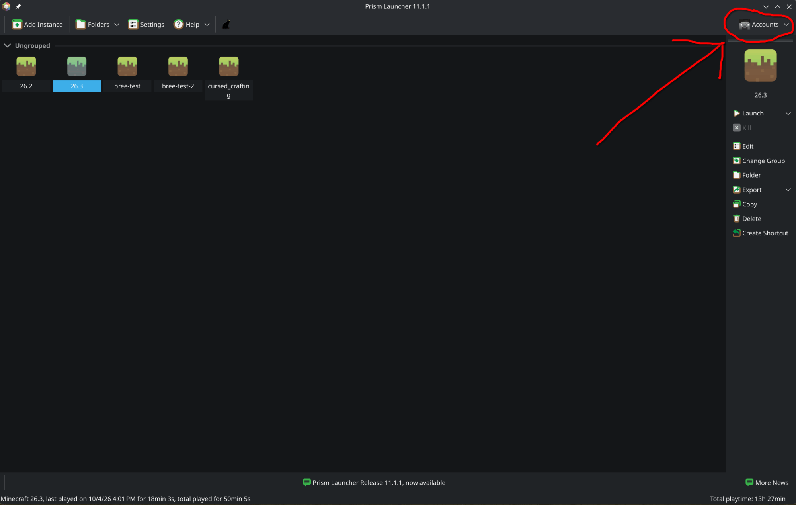
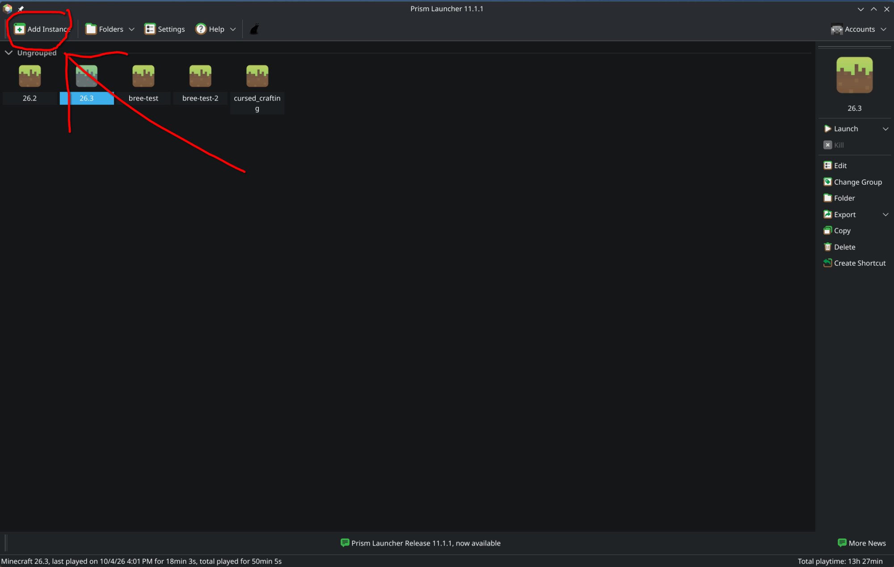
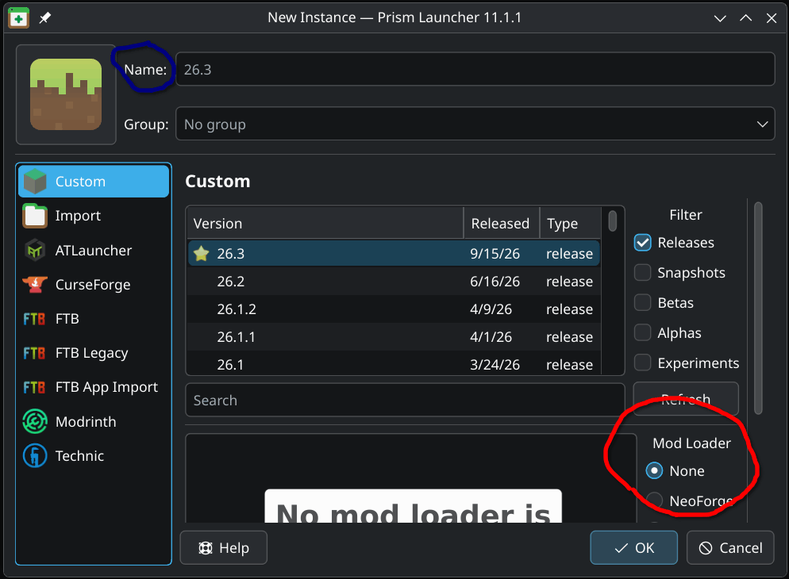
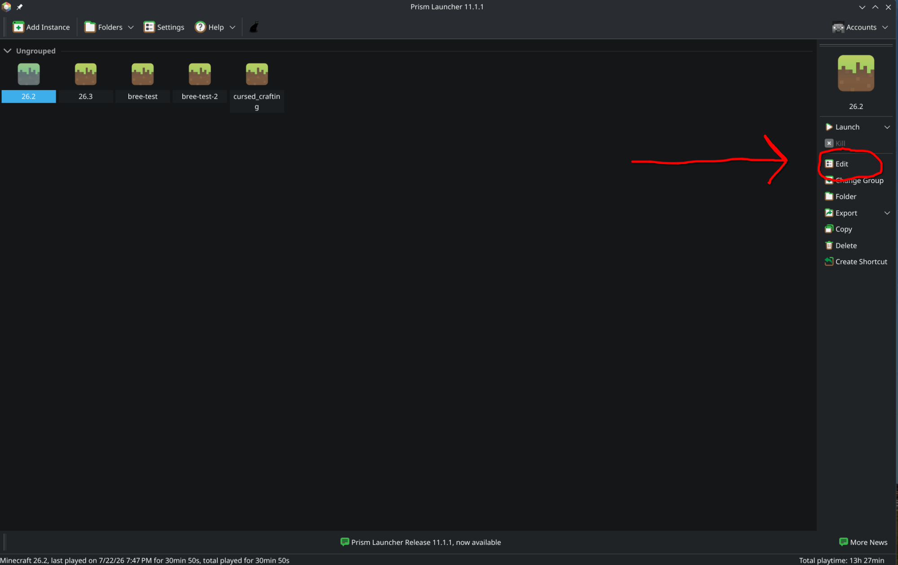
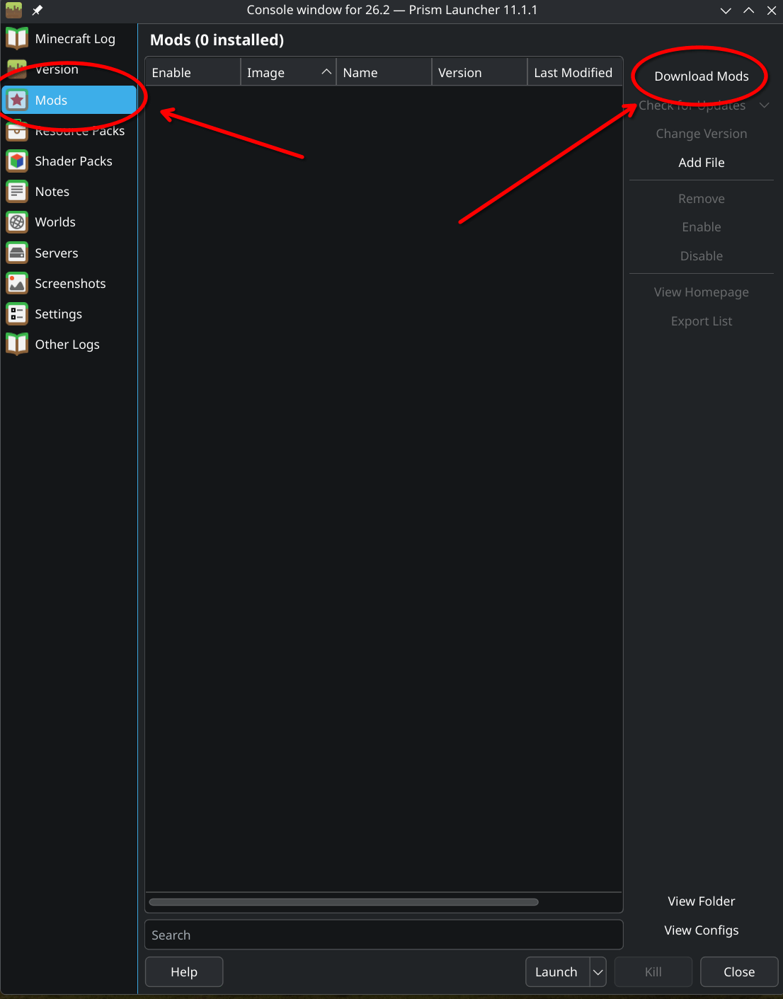
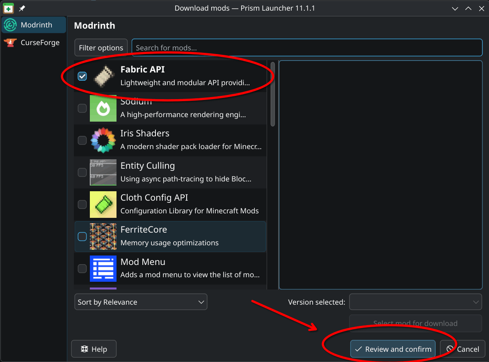
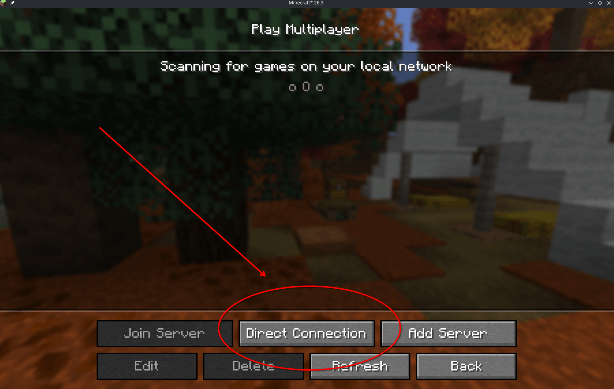

# Disclaimer

**This server is a hobby project. The servers *should* be up
all the time, but I make no promises. I may be messing 
around with something or something just breaks, and I'm
busy so I can't always fix it quickly.**

> #### Note
> 
> If you already are comfortable with minecraft mods,
> you can do this the way you know how. Otherwise just
> ignore this note and
> go to Step 1.
>
> If you are comfortable, the
> only mod you really need is called Modflared, it's
> on Modrinth. Im using Fabric modloader, it might work
> with other stuff though. If you don't follow my
> directions I don't offer support though. The warranty
> is void.
>
> * If you didn't understand any of that, don't worry,
> just ignore this note completely

## Step 1 - Prism Launcher
The supported (by me) path is through an app called 
Prism Launcher. To get it set up, start by going to 
their [website](https://prismlauncher.org/) and following their instructions. Once
you have it installed, go to the top right corner where
it says to log in to your account, and do so. This
account must own Minecraft of course.

Then you should have Prism Launcher set up!

## Step 2 - Creating an instance

Next, we need to create an instance. Go to the top left
and click "Add Instance".

A popup like this should show up. You can leave everything
default ***except*** changing the modloader. Scroll down and
select *Fabric* then hit Ok.

> #### Note
>
> When we start we will be on the latest minecraft version (26.3)
> but if you are joining later make sure that your version (in the
> middle) is 26.3. If/when we update later I will add a message
> bellow this.
> 
And now we have our first instance set up!

## Step 3 - Adding Mods

Select your instance if it is not already. A bar should be
visible on the right. Select "Edit".

Once there, select "Mods" then "Download Mods".

Select "Fabric API" and "Modflared" from the mods list. You'll
have to search for Modflared. Then press review and confirm,
make sure both are selected, then hit OK.

Now we have the mods installed! Thats all the hard parts.

## Step 4 - Connecting to the server

Click launch in the the right menu for the instance. This will
launch the game, but it needs to download all the files so
it will take a minute.

Once the game is launched, click through until you get to the
main menu. Click Multiplayer, then Direct Connection.

The server address is in the discord for privacy.

Once your in, thats it! I hope you know how to play Minecraft.
